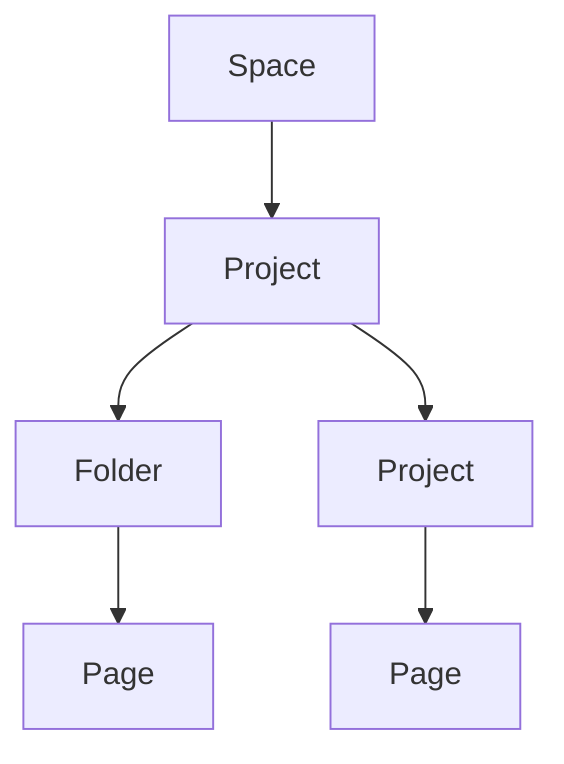

## Overview

McCartney organizes your project documentation into structured spaces. You create spaces to group related docs, manage hierarchies, and handle workflows efficiently. These concepts form the foundation for building scalable documentation.

Key elements include documentation spaces, project hierarchies, content formats, update workflows, and team scalability. Master these to streamline your documentation process.

<Columns cols={3}>
  <Card title="Spaces" icon="layers" href="#documentation-spaces">
    Group docs logically.
  </Card>
  <Card title="Hierarchy" icon="git-branch" href="#hierarchy">
    Nested project structure.
  </Card>
  <Card title="Workflow" icon="git-pull-request" href="#workflow">
    Review and update process.
  </Card>
</Columns>

## Documentation Spaces

Documentation spaces act as top-level containers in McCartney. You use them to separate concerns, such as API docs from user guides. Each space supports its own permissions, themes, and navigation.

Create a space via the dashboard at `https://dashboard.example.com/spaces/new`. Spaces enable isolated workflows while sharing common assets like brand colors (`#3B82F6` for McCartney).

<Callout kind="tip">
  Start with one space per major project phase: planning, development, release.
</Callout>

## Project Management Hierarchy

McCartney uses a tree-like hierarchy: Space → Project → Folder → Page. This mirrors your repository structure.



You nest pages deeply for complex docs. Access via `https://docs.example.com/{space}/{project}/{page}`.

## Content Types and Formats

McCartney supports multiple content types. Switch between them based on your needs.

<Tabs>
  <Tab title="MDX Pages" icon="file-text">
    Rich pages with components like `<Callout>` and `<Steps>`.
    
````mdx
---
title: My Page
---

## Content

<Callout kind="info">Tip here.</Callout>
````
  </Tab>
  <Tab title="Markdown" icon="markdown">
    Simple `.md` files for quick notes.
    
````markdown
# Simple Doc

- List item
- Another item
````
  </Tab>
  <Tab title="YAML Frontmatter" icon="database">
    Metadata for all pages.
    
````yaml
---
title: "Doc Title"
description: "Summary"
tags: ["guide", "api"]
---
````
  </Tab>
</Tabs>

## Workflow for Updates and Reviews

Follow this sequence to update content collaboratively.

<Steps>
  <Step title="Draft Changes" icon="edit-3">
    Edit in your preferred editor.
  </Step>
  <Step title="Preview Locally" icon="eye">
    Run `npx mdx-bundler preview page.mdx`.
  </Step>
  <Step title="Submit PR" icon="git-pull-request">
    Push to GitHub for review.
  </Step>
  <Step title="Merge and Deploy" icon="git-merge">
    Auto-deploys on merge to main.
  </Step>
</Steps>

<CodeGroup tabs="npm,yarn">
````bash
npm install mdx-bundler
````

````bash
yarn add mdx-bundler
````
</CodeGroup>

## Scalability for Teams

McCartney scales with your team size. Assign roles per space: admin, editor, viewer.

<Expandable title="Advanced Permissions" default-open="false">
  Use RBAC with groups. Example config:
  
````json
{
  "space": "docs",
  "roles": {
    "admin": ["write", "delete"],
    "editor": ["write"]
  }
}
````
</Expandable>

<Callout kind="success">
  Teams of 50+ report 40% faster doc cycles.
</Callout>

<Columns cols={2}>
  <Card title="Next: Quickstart" icon="rocket" href="/quickstart">
    Set up your first space.
  </Card>
  <Card title="API Reference" icon="api" href="/authentication">
    Integrate programmatically.
  </Card>
</Columns>