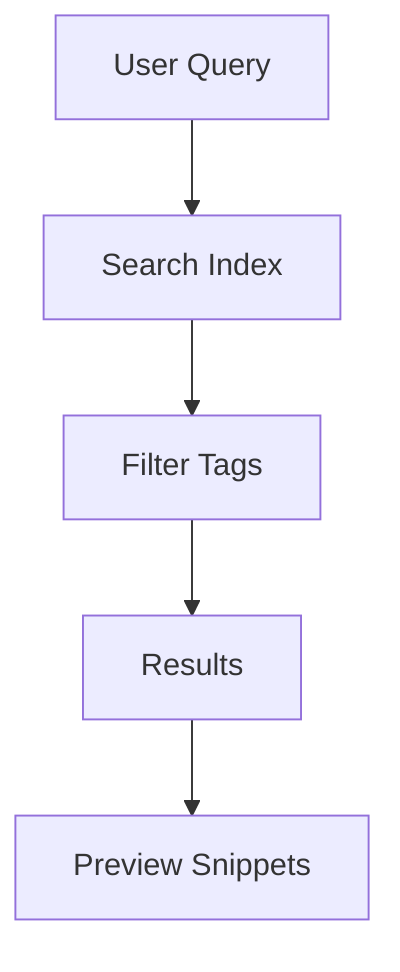

## Overview

McCartney provides powerful tools to streamline your documentation workflow. You organize content into folders, collaborate with teams, track versions, search efficiently, and customize branding. These features help you maintain professional docs at scale.

<Callout kind="info">
  Start by creating your first folder to structure content. Use the dashboard at `https://dashboard.example.com` for quick access.
</Callout>

## Key Features

Discover the core capabilities through these highlighted features.

<Columns cols={3}>
  <Card title="Document Organization" icon="folder" href="#document-organization">
    Structure docs with nested folders and tags.
  </Card>
  <Card title="Collaboration" icon="users" href="#collaboration">
    Share and review docs with your team securely.
  </Card>
  <Card title="Version Control" icon="git-branch" href="#version-control">
    Track changes and revert to previous versions.
  </Card>
  <Card title="Search Tools" icon="search" href="#search-tools">
    Find content quickly with advanced filtering.
  </Card>
  <Card title="Customization" icon="palette" href="#customization">
    Apply your brand color like `#3B82F6`.
  </Card>
</Columns>

## Document Organization and Folders

Organize your docs hierarchically. Create folders for projects, teams, or topics. Add tags for cross-referencing.

<Steps>
  <Step title="Create Folder" icon="folder-plus">
    Navigate to the dashboard and select **New Folder**.

    ```bash
    curl -X POST https://api.example.com/v1/folders \
      -H "Authorization: Bearer YOUR_API_KEY" \
      -d '{"name": "Project Docs", "parentId": null}'
    ```
  </Step>
  <Step title="Add Document" icon="file-plus">
    Upload MDX files directly or via API.
  </Step>
  <Step title="Tag Content" icon="tag">
    Assign tags like `api`, `guide` for easy filtering.
  </Step>
</Steps>

## Collaboration and Sharing Options

Invite team members and control access. Share public links or embed docs.

<Tabs>
  <Tab title="Team Invite" icon="mail">
    Send invites via email or Slack integration.

    <CodeGroup tabs="JavaScript,Python">
    ````javascript
    const response = await fetch('https://api.example.com/v1/invites', {
      method: 'POST',
      headers: { 'Authorization': `Bearer ${YOUR_API_KEY}` },
      body: JSON.stringify({ email: 'team@company.com', role: 'editor' })
    });
    ````
    ````python
    import requests
    response = requests.post('https://api.example.com/v1/invites',
      headers={'Authorization': f'Bearer {YOUR_API_KEY}'},
      json={'email': 'team@company.com', 'role': 'editor'})
    ````
    </CodeGroup>
  </Tab>
  <Tab title="Public Share" icon="globe">
    Generate read-only links for external stakeholders.
  </Tab>
</Tabs>

## Version Control for Docs

Every change creates a new version. Compare diffs and rollback easily.

```javascript highlight="2-4" show-lines={true}
const versions = await fetch('https://api.example.com/v1/docs/my-doc/versions', {
  headers: { 'Authorization': `Bearer ${YOUR_API_KEY}` }
}).then(res => res.json());

console.log(versions[0]); // Latest version
```

<Callout kind="tip">
  Enable auto-save to capture changes in real-time. Use `https://dashboard.example.com/docs` to view history.
</Callout>

## Search and Filtering Tools

Search across all docs with full-text indexing. Filter by tags, folders, or dates.



## Customization with Brand Color

Tailor your docs to match your brand. Set primary color to `#3B82F6` for buttons and headers.

<Expandable title="Advanced Branding" default-open="false">
  Update via API:

  ````json
  {
    "brandColor": "#3B82F6",
    "logoUrl": "https://your-logo.com/logo.png"
  }
  ````

  Apply in CSS: `--primary-color: #3B82F6;`
</Expandable>

<Columns cols={2}>
  <Card title="Quickstart" icon="rocket" href="/quickstart">
    Get started in minutes.
  </Card>
  <Card title="Authentication" icon="lock" href="/authentication">
    Secure your API access.
  </Card>
</Columns>